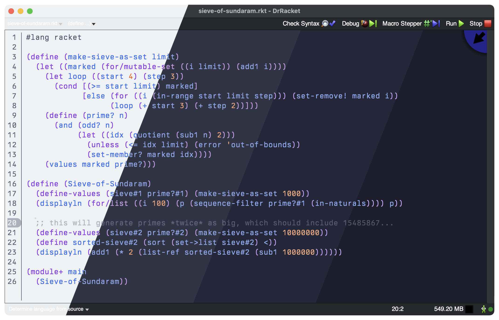
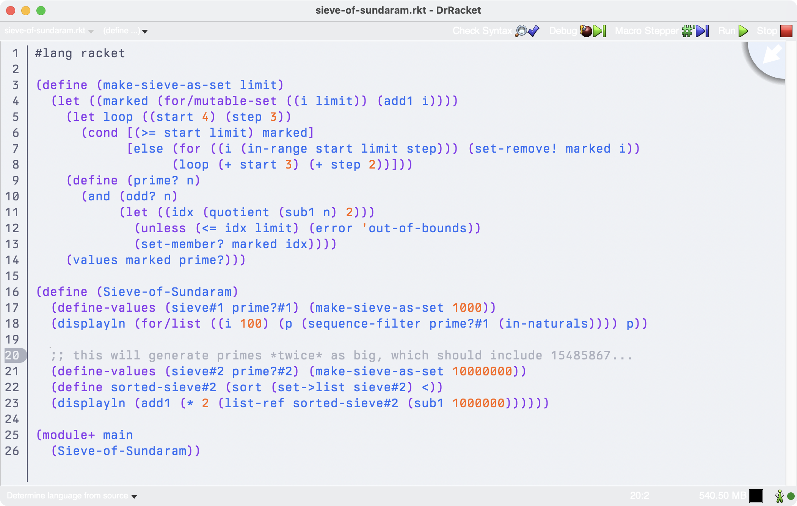
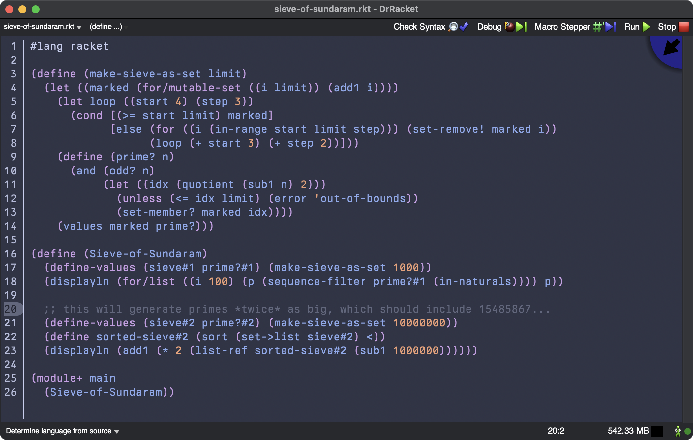
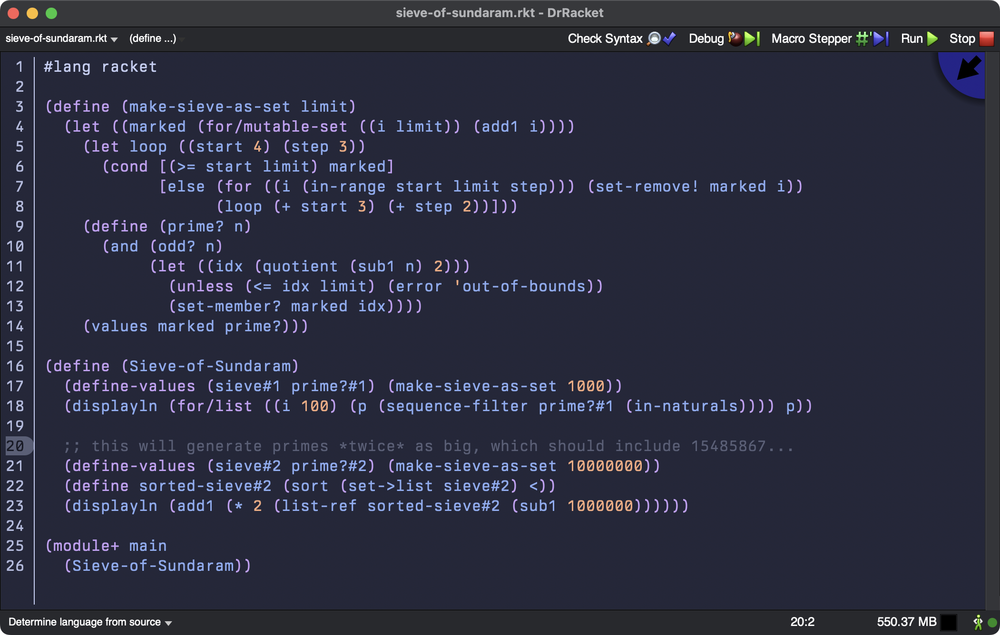
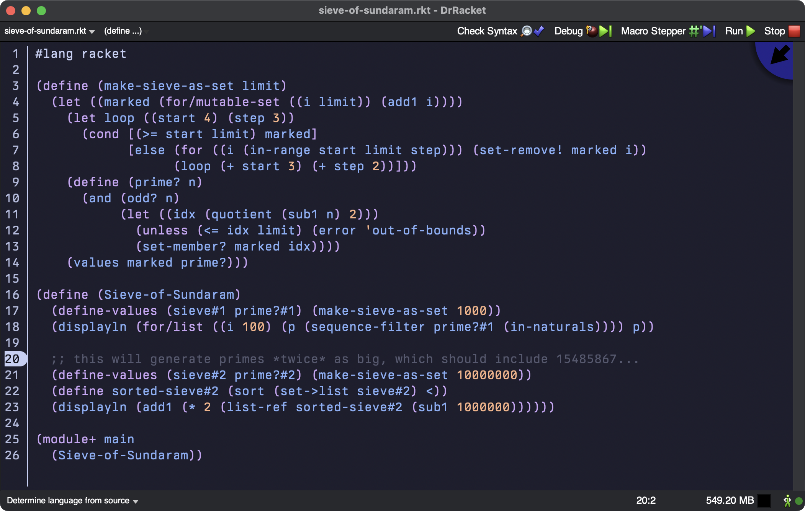

<h3 align="center">
	<br/>
	
	Catppuccin for <a href="https://docs.racket-lang.org/drracket">DrRacket</a>
	
</h3>

<p align="center">
  
</p>

## Previews

<details>
<summary>🌻 Latte</summary>

</details>
<details>
<summary>🪴 Frappé</summary>

</details>
<details>
<summary>🌺 Macchiato</summary>

</details>
<details>
<summary>🌿 Mocha</summary>

</details>

# Usage

1. Install DrRacket and find where `raco` is located.
   - On Linux this should already be on your `$PATH`.
   - On macOS, it's at `/Applications/Racket/bin/raco`.
2. Use `raco` to install the package:

    ```bash
    raco pkg install catppuccin-theme
    ```

3.  Choose the theme in the `Preferences`. You might need to reload the IDE for the theme to appear.

## 💝 Thanks to

- [PanAeon](https://github.com/PanAeon)

&nbsp;

<p align="center">
	
</p>

<p align="center">
	Copyright &copy; 2021-present <a href="https://github.com/catppuccin" target="_blank">Catppuccin Org</a>
</p>

<p align="center">
	<a href="https://github.com/catppuccin/catppuccin/blob/main/LICENSE"></a>
</p>
